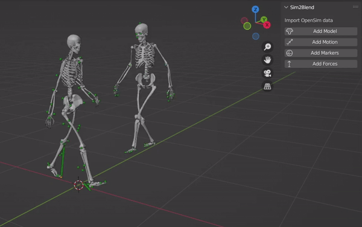

[](https://github.com/Naereen/badges/)
[](https://opensource.org/license/mit)
[](https://doi.org/10.5281/zenodo.8421820)


# Sim2Blend

**`Sim2Blend` is a Blender add-on for importing OpenSim data:** model, motion, markers, and forces.

[OpenSim](https://simtk.org/projects/opensim) is an open-source software for research in biomechanics, widely used in motion capture (MoCap). [Blender](https://www.blender.org) is an open-source software used for 3D modeling, animation, and rendering. 

Feel free to try [Pose2Sim](https://github.com/perfanalytics/pose2sim), an open-source pipeline for obtaining research-grade OpenSim results from consumer-grade cameras.



> N.B.: Sim2Blend is inspired from [BlendOsim](https://github.com/JonathanCamargo/BlendOsim). Unlike BlendOsim, Sim2Blend does not require using Matlab as an intermediary (and expensive) software between two open-source ones.\
> N.B.: This is still an alpha version, and some of the buttons displayed in the GUI won't lead to any action.

## Contents
1. [Demonstration](#demonstration)
2. [Quick install](#quick-install)
3. [Full install](#full-install)
4. [How to cite and how to contribute](#how-to-cite-and-how-to-contribute)


## Demonstration

Find example files in the `Examples` folder, or use it with you own OpenSim data.

- **Add Model**: \
  Import the "bodies" of an `.osim` model. \
  *If you did the [full install](#full-install) and some Geometry files exist only as .vtp, they will automatically be converted to .stl.*
- **Add Motion**: \
  Import a `.mot` or a `.csv` motion file. \
  *If you did the [full install](#full-install), you can import a `.mot` file. Calculating all body segment positions may take a while if the model is complex or if there are many time frames. Creates a .csv file for faster loading next time.* \
  *If not, you will have to [install the OpenSim API](https://simtk-confluence.stanford.edu:8443/display/OpenSim/Conda+Package) outside of Blender and use [bodykin_from_mot_osim.py](https://github.com/perfanalytics/pose2sim/blob/main/Pose2Sim/Utilities/bodykin_from_mot_osim.py) to convert it to .csv.*
- **Add Markers**: \
  Import a `.trc` or a `.c3d` marker file. 
- **Add Forces**: \
  Import a `.mot` GRF force file.

<br>

## Quick install

- Install [Blender](https://www.blender.org/download/) (haven't tried with versions other than 3.6)
- Download [Sim2Blend.zip](https://github.com/davidpagnon/Sim2Blend/raw/main/Sim2Blend.zip)

<br>

- Open Blender -> Edit -> Preferences -> Add-ons -> Install -> Choose Sim2Blend.zip
- Check `Sim2Blend` to enable it
- Press `n` or Click on the tiny arrow on the upper-right corner of the 3D viewport to open the tool


<br>

## Full install

Full install requires admin rights on your computer. It is a little tricky, but the following steps should do it smoothly. If you encounter any issue, please [submit an issue](https://github.com/davidpagnon/Sim2Blend/issues). It is still only available on Windows, but feel free to contribute and adapt it on other platforms!

#### Prerequisites

- Install [Blender](https://www.blender.org/download/) (haven't tried with versions other than 3.6)
- Install [Miniconda](https://docs.conda.io/en/latest/miniconda.html)
- Download [Sim2Blend.zip](https://github.com/davidpagnon/Sim2Blend/raw/main/Sim2Blend.zip)

#### Find your Blender Python version

Open Blender, press Shift+F4, type the following lines:

``` python
import sys
sys.version
```

#### Install Sim2Blend libraries

Open Miniconda, and copy-paste these lines. Replace with the Python version you just found:
``` cmd
conda create -n Sim2Blend python=3.10.12 -y 
conda activate Sim2Blend
conda install -c opensim-org opensim -y
pip uninstall numpy
pip install numpy toml bpy vtk
```

#### Install Sim2Blend add-on

You will need admin rights for the next steps:
- Rename `python` in `C:\Program Files\Blender Foundation\Blender 3.6\3.6\python` to `python_old`
- Copy-paste there your `Sim2Blend` environment folder (to find its location, type `conda env list` in Anaconda prompt). Rename it to `python`
- Open `C:\Program Files\Blender Foundation\Blender 3.6\3.6\python\Lib\opensim\__init__.py` 
  - comment out the line `# from .moco import *`
  - line 4, add the path to your OpenSim bin folder: `os.add_dll_directory(r"C:/OpenSim 4.4/bin")`


#### If you need the last OpenSim beta version
- Replace the conda install line by  
`conda install https://anaconda.org/opensim-org/opensim/4.5/download/win-64/opensim-4.5-py310np121.tar.bz2 -y`
- Line 17 (instead of 4), `add os.add_dll_directory(r"C:/OpenSim 4.5/bin")`
- You may also need to install [OpenSim 4.5 beta](https://simtk.org/frs/?group_id=91#:~:text=OpenSim%20Release%20Betas) first, and to change its path from something like `C:/OpenSim 4.5-2023-12-04-cfbf426` to `C:/OpenSim 4.5`.


#### Install Sim2Blend add-on in Blender

- Blender -> Edit -> Preferences -> Add-ons -> Install -> Choose Sim2Blend.zip
- Check `Sim2Blend` to enable it
- Press `n` or Click on the tiny arrow on the upper-right corner of the 3D viewport to open the tool

<br>


## How to cite and how to contribute

### How to cite

If you use Sim2Blend, please cite [Pagnon and Camargo, 2023].

     @misc{Pagnon2023,
       author = {Pagnon, David and Camargo, Jonathan},
       title = {Sim2Blend - OpenSim results in Blender},
       year = {2023},
       doi= {10.5281/zenodo.8421820},
       publisher = {GitHub},
       journal = {GitHub repository},
       howpublished = {\url{https://github.com/davidpagnon/Sim2Blend}},
     }

### How to contribute

I would happily welcome any proposal for new features, code improvement, and more!\
If you want to contribute to Sports2D, please follow [this guide](https://docs.github.com/en/get-started/quickstart/contributing-to-projects) on how to fork, modify and push code, and submit a pull request. I would appreciate it if you provided as much useful information as possible about how you modified the code, and a rationale for why you're making this pull request. Please also specify on which operating system, as well as which Python, Blender, OpenSim versions you have tested the code.

*Here is a to-do list. Feel free to complete it:*
- [x] Import data from standard OpenSim data files (.osim, .mot, .trc, grf.mot)
- [x] Convert .vtp files to .stl if .stl not found on disk
- [x] Save segment angles to .csv files for faster loading of motion next time
- [x] Import multiple persons in the same scene
- [x] Create Example data
- [x] Import c3d files (borrowed and adapted from [io_anim_c3d](https://github.com/MattiasFredriksson/io_anim_c3d) )
- [ ] Rig model
- [ ] Add other tool for importing or exporting cameras, and for importing videos or filming (see [Maya-Mocap](https://github.com/davidpagnon/Maya-Mocap/))
- [ ] Import .sto motion and force files
- [ ] Import .c3d and .trc files with the same appearance
- [ ] Tutorial for Mac/Linux
- [ ] Install OpenSim (for motion .mot files) with a click within the addon (create a venv with the right Python version [cf CEB](https://drive.google.com/file/d/1x3JfKfUXwi-61AqsbDeMVRS_h66Ap-dW/view), install OpenSim and the other dependencies)
- [ ] Export to universal Collada .dae file
