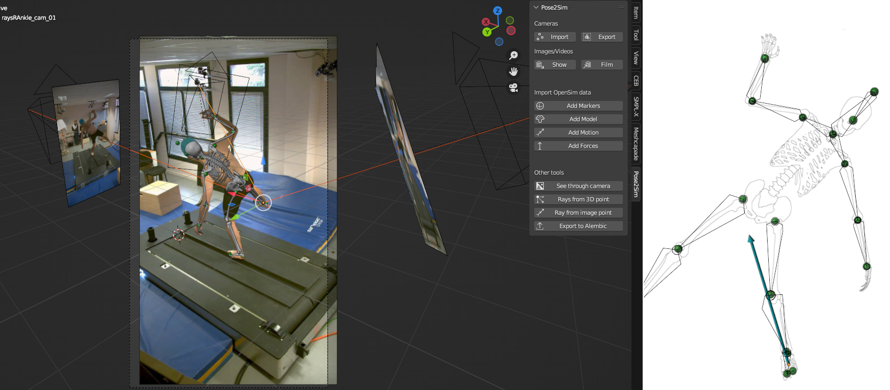
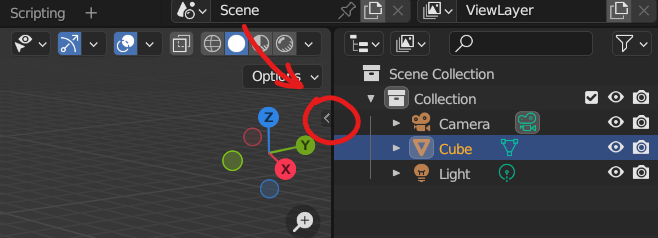

[](https://github.com/Naereen/badges/)
[](https://opensource.org/license/mit)
[](https://zenodo.org/doi/10.5281/zenodo.10658947)


# Pose2Sim Blender

**`Pose2Sim_Blender` is a Blender add-on for visualizing [Pose2Sim](https://github.com/perfanalytics/pose2sim) results -- and more.**

> N.B.:
> - Faster .mot import
> - Fixed various issues

[Pose2Sim](https://github.com/perfanalytics/pose2sim) is an open-source pipeline for obtaining research-grade 3D motion analysis from consumer-grade cameras (**such as phones, webcams, GoPros, etc**).

This add-on can be used to visualize:
- Camera calibration (from a `.toml` file)
- Markers (from a `.trc` or `.c3d` file)
- **OpenSim** data (such as `.osim` models, `.mot` motions, and `.mot` forces)
- And much more...

<!--  -->



> N.B.:\
[OpenSim](https://simtk.org/projects/opensim) is an open-source software for research in biomechanics, widely used in motion capture (MoCap).\
[Blender](https://www.blender.org) is an open-source software used for 3D modeling, animation, and rendering.

<br>

## Contents
1. [Installation](#installation)
    1. [Quick install](#quick-install)
    2. [Full install](#full-install)
2. [Demonstration](#demonstration)
    1. [Camera tools](#camera-tools)
    2. [OpenSim imports](#opensim-imports)
    3. [Other tools](#other-tools)
4. [How to cite and how to contribute](#how-to-cite-and-how-to-contribute)


https://github.com/davidpagnon/Pose2Sim_Blender/assets/54667644/a2cfb75d-a2d4-471a-b6f8-8f1ee999a619


<br>

## Installation

### Quick install

> N.B.: Full install is required for importing `.mot` motion files.

- Install [Blender](https://www.blender.org/download/) 
- Download [Pose2Sim_Blender.zip](https://github.com/davidpagnon/Pose2Sim_Blender/raw/main/Pose2Sim_Blender.zip)

<br>

- Open Blender -> Edit -> Preferences -> Add-ons -> Install -> Choose Pose2Sim_Blender.zip
- Check `Pose2Sim Blender` to enable it
- Press `n` or Click on the tiny arrow on the upper-right corner of the 3D viewport to open the tool



<br>

### Full install

> Only needed for importing `.mot` motion files.

Full installation requires admin rights on your computer. It is a little tricky, but the following steps should do it smoothly. If you encounter any issues, please [submit an issue](https://github.com/davidpagnon/Pose2Sim_Blender/issues). Only Windows has been tested, but feel free to tell me how it goes on other platforms!

##### 1. Prerequisites

  - Install [Blender](https://www.blender.org/download/) (tested on v 3.6 and 4.0.)
  - Install [Miniconda](https://docs.conda.io/en/latest/miniconda.html)
  - Download [Pose2Sim_Blender.zip](https://github.com/davidpagnon/Pose2Sim_Blender/raw/main/Pose2Sim_Blender.zip)

##### 2. Find your Blender Python version

&nbsp;&nbsp;Open Blender, press Shift+F4, type the following lines:
  
  ```python
  import sys
  sys.version
  ```
  
##### 3. Install Pose2Sim_Blender libraries
  
  - Open Miniconda, and copy-paste these lines.\
  *Replace with the Python version you just found*:
  ```cmd
  conda create -n Pose2Sim_Blender python=3.10.13 -y 
  conda activate Pose2Sim_Blender
  conda install -c opensim-org opensim -y
  pip uninstall numpy
  pip install numpy bpy toml vtk
  ```
  - Now write down the location of your newly created environment (typically `C:\Users\<USERNAME>\miniconda3\envs\Pose2Sim_Blender`):
  ```cmd
  conda env list
  ```
  - OpenSim installation needs to be fixed. Open *<LOCATION_OF_POSE2SIM_BLENDER_ENV>\Lib\opensim\\_\_init\_\_.py* with any text editor:
    - comment out the line `# from .moco import *`
    - line 4, insert the path to your OpenSim bin folder: `os.add_dll_directory(r"C:/OpenSim 4.5/bin")`.\
      *Replace 4.5 with the version you installed*

##### 4. Link your conda environment to Blender Python

  &nbsp;&nbsp;Open CMD as an administrator.\
  &nbsp;&nbsp;*Replace with your Blender version and with the location of your Pose2Sim_Blender environment*:
  ```cmd
  cd "C:\Program Files\Blender Foundation\Blender 4.0\4.0"
  mv python python_old
  mklink /j python <LOCATION_OF_POSE2SIM_BLENDER_ENV>
  mv /j python\DLLs python\DLLs_old
  mklink /j python\DLLs python_old\DLLs
  mklink /j python\bin python_old\bin
  ```
  &nbsp;&nbsp;**Now, any package you install in your conda environment will immediately be available in Blender.**


<!-- #### If you need the last OpenSim beta version
- Replace the conda install line by  
`conda install https://anaconda.org/opensim-org/opensim/4.5/download/win-64/opensim-4.5-py310np121.tar.bz2 -y`
- Line 17 (instead of 4), `add os.add_dll_directory(r"C:/OpenSim 4.5/bin")`
- You may also need to install [OpenSim 4.5 beta](https://simtk.org/frs/?group_id=91#:~:text=OpenSim%20Release%20Betas) first, and to change its path from something like `C:/OpenSim 4.5-2023-12-04-cfbf426` to `C:/OpenSim 4.5`. -->

<!-- If you want to install an additional package from Blender
- Copy the bin directory from python_old to python
- https://blenderartists.org/t/can-i-install-pandas-or-other-modules-into-blenders-python/1375122
    import sys, subprocess, os
    python_exe = os.path.join(sys.prefix, 'bin', 'python.exe') # remove '.exe' on Linux
    subprocess.call([python_exe, "-m", "pip", "install", "pandas"])
-->

##### 5. Install Pose2Sim_Blender add-on in Blender
  
  - Blender -> Edit -> Preferences -> Add-ons -> Install -> Choose Pose2Sim_Blender.zip
  - Check `Pose2Sim_Blender` to enable it
  - Press `n` or Click on the tiny arrow on the upper-right corner of the 3D viewport to open the tool

<br>


## Demonstration

Find example files in the `Examples` folder of your [Pose2Sim_Blender.zip](https://github.com/davidpagnon/Pose2Sim_Blender/raw/main/Pose2Sim_Blender.zip) archive.

### Camera tools

- **Import:**\
  Import a `.toml` calibration file from Pose2Sim.
- **Export:**\
  Export updated cameras as a `.toml` calibration file.
- **Show:**\
  Import videos, image sequences, or still images in your camera frame of reference. The image plane is automatically scaled when translated.
- **Film:**\
  Render view from all or selected cameras, as a movie or an image sequence. Choose your framerate, the first and last frame to be rendered, and the output quality.

### OpenSim imports

- **Import Markers**:\
  Import a `.trc` or a `.c3d` marker file, e.g., generated by Pose2Sim triangulation.\
  ***N.B.:** Make sure you entered the right `Target framerate` (upper right corner).*
- **Import Model**:\
  Import the "bodies" of an `.osim` model. \
  *If you did the [full install](#full-install) and some Geometry files exist only as .vtp, they will automatically be converted to .stl.*
- **Import Motion**:\
  Import a `.mot` or a `.csv` motion file. ***N.B.:** Make sure you entered the right `Target framerate`  (upper right corner).*
  - *If you did the [full install](#full-install), you can import a `.mot` file. Calculating all body segment positions may take a while if the model is complex or if there are many time frames. Creates a .csv file for faster loading next time.*
  - *If not, you will have to [install the OpenSim API](https://simtk-confluence.stanford.edu:8443/display/OpenSim/Conda+Package) outside of Blender and use [bodykin_from_mot_osim.py](https://github.com/perfanalytics/pose2sim/blob/main/Pose2Sim/Utilities/bodykin_from_mot_osim.py) to convert it to .csv.*
- **Import Forces**:\
  Import a `.mot` GRF force file.\
  ***N.B.:** Make sure you entered the right `Target framerate` (upper right corner).*

### Other tools

- **See through cameras:**\
  View from selected camera, with markers and OpenSim model overlay.
- **Rays from 3D point:**\
  Trace rays from one or several selected 3D points. *This can help you verify if a triangulated point correctly meets 2D keypoints on image planes.*
- **Ray from image point:**\
  ***Coming soon!*** Trace ray from a point selected on an image plane. *This can help you see if rays intersect correctly.* 
- **Export to Alembic:**\
  Export to an `.abc` Alembic "baked" file, for fast import into other softwares.

<br>


## How to cite and how to contribute

### How to cite

If you use Pose2Sim_Blender, please cite [Pagnon et al., 2022b](https://doi.org/10.21105/joss.04362).

     @Article{Pagnon_2022_JOSS, 
      AUTHOR = {Pagnon, David and Domalain, Mathieu and Reveret, Lionel}, 
      TITLE = {Pose2Sim: An open-source Python package for multiview markerless kinematics}, 
      JOURNAL = {Journal of Open Source Software}, 
      YEAR = {2022},
      DOI = {10.21105/joss.04362}, 
      URL = {https://joss.theoj.org/papers/10.21105/joss.04362}
     }

### How to contribute

I would happily welcome any proposal for new features, code improvement, and more!\
If you want to contribute to Sports2D, please follow [this guide](https://docs.github.com/en/get-started/quickstart/contributing-to-projects) on how to fork, modify and push code, and submit a pull request. I would appreciate it if you provided as much useful information as possible about how you modified the code, and a rationale for why you're making this pull request. Please also specify on which operating system, as well as which Python, Blender, OpenSim versions you have tested the code.

*Here is a to-do list. Feel free to complete it:*
- [x] Import data from standard OpenSim data files (.osim, .mot, .trc, grf.mot)
- [x] Import c3d files (borrowed and adapted from [io_anim_c3d](https://github.com/MattiasFredriksson/io_anim_c3d) )
- [x] Save segment position and orientation to .csv files for faster loading of motion next time
- [x] Import multiple persons in the same scene
- [x] Create Example data
- [x] Convert .vtp files to .stl if .stl not found on disk
- [ ] **Rig from OpenSim model and/or imported markers**
- [ ] Import .sto motion and force files
- [ ] Import .c3d and .trc files with the same appearance
- [ ] Install OpenSim (for motion .mot files) with a click within the addon (create a venv with the right Python version [cf CEB](https://drive.google.com/file/d/1x3JfKfUXwi-61AqsbDeMVRS_h66Ap-dW/view), install OpenSim and the other dependencies)

<br>

- [x] Import cameras from .toml calibration file
- [x] Export cameras to .toml calibration file
- [x] Import images, image sequences, and videos in the camera view
- [x] Viewport render to film with selected cameras

<br>

- [x] See through camera and overlay model and markers
- [x] Reproject rays from selected 3D points to image view
- [ ] Trace rays from camera to selected image point
- [x] Export to .abc Alembic files

<br> 

- [x] Write documentation
- [x] Create video tutorial
