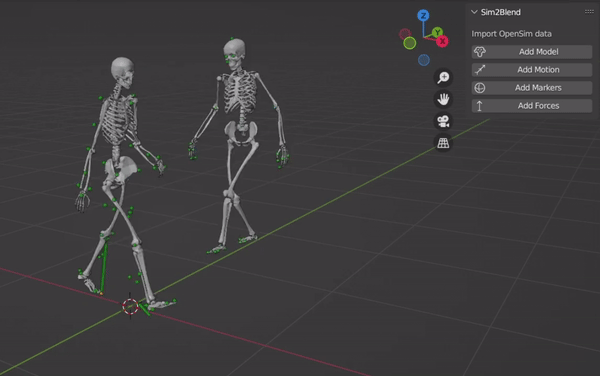
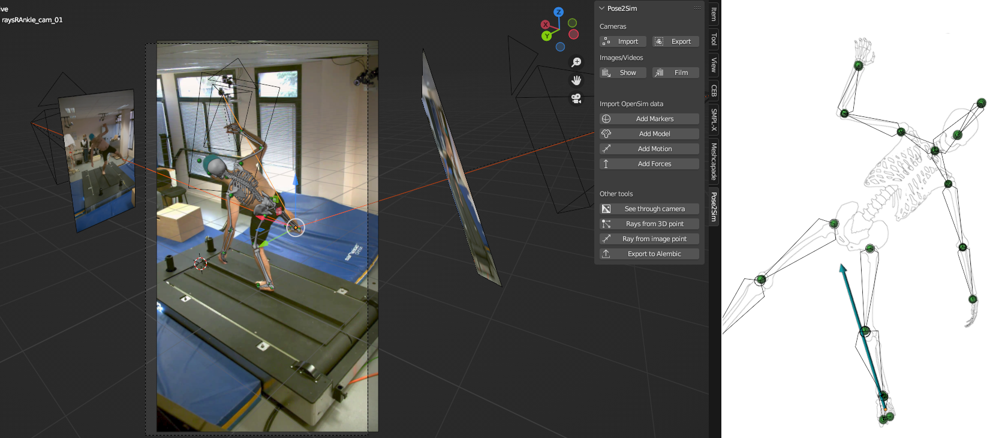
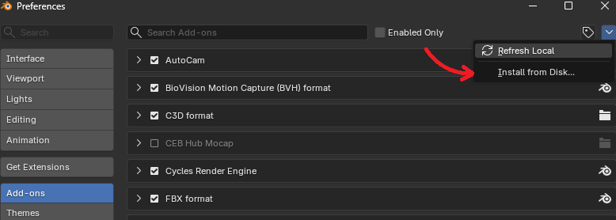
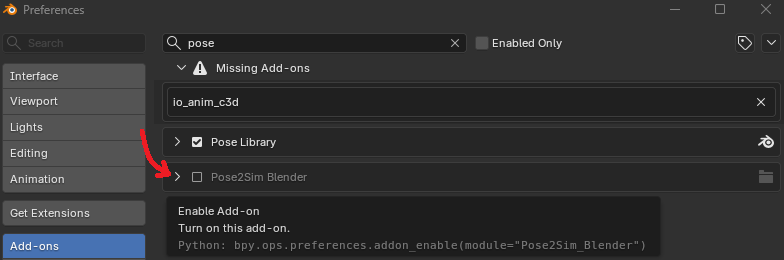
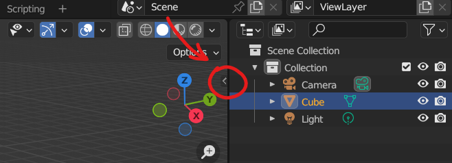

\

# Pose2Sim Blender

**`Pose2Sim_Blender` is a Blender add-on for visualizing [Pose2Sim](https://github.com/perfanalytics/pose2sim) results, and rigging your character with markerless kinematics.**

This add-on can be used to visualize:
- Camera positions, orientations, field of view, etc. (using a `.toml` calibration file)
- Videos, image sequences, or still images in the camera frame of reference
- Markers trajectories (from `.trc` or `.c3d` files)
- Skeletal OpenSim data (`.osim` models, `.mot` motions, and `.mot` forces)
- And much more...

<!--  -->

> N.B.:\
> [Pose2Sim](https://github.com/perfanalytics/pose2sim) is an open-source pipeline for obtaining research-grade 3D motion analysis from consumer-grade cameras (**such as phones, webcams, GoPros, etc**). Its main application fields are sports science, biomechanics, and animation. \
[OpenSim](https://simtk.org/projects/opensim) is an open-source software for research in biomechanics, widely used in motion capture (MoCap).\
[Blender](https://www.blender.org) is an open-source software used for 3D modeling, animation, and rendering.

 

# Contents
1. [Installation](#installation)
2. [Demonstration](#demonstration)
    1. [Camera tools](#camera-tools)
    2. [OpenSim imports](#opensim-imports)
    3. [Other tools](#other-tools)
4. [How to cite and how to contribute](#how-to-cite-and-how-to-contribute)

https://github.com/davidpagnon/Pose2Sim_Blender/assets/54667644/a2cfb75d-a2d4-471a-b6f8-8f1ee999a619

 

# Installation

> For Blender < 4.4, see the old and tricky installation procedure [here](https://github.com/davidpagnon/Pose2Sim_Blender/tree/099dce48c7734bbfc0d6f7d1cb4699d4ca1e0623#installation). I'd strongly suggest updating your Blender version instead.

 

- Install [Blender](https://www.blender.org/download/) 
- Download [Pose2Sim_Blender.zip](https://github.com/davidpagnon/Pose2Sim_Blender/raw/main/Pose2Sim_Blender.zip)

 

- Open Blender -> Edit -> Preferences -> Add-ons -> Down arrow to the upper-right corner -> Install from Disk... -> Choose Pose2Sim_Blender.zip\
  ⚠️ It might take a few minutes to install, as all the required dependencies will be installed in the background.
- Check `Pose2Sim Blender` to enable it
- Press `n` or Click on the tiny arrow on the upper-right corner of the 3D viewport to open the tool

 

# Demonstration

Find example files in the `Examples` folder of your [Pose2Sim_Blender.zip](https://github.com/davidpagnon/Pose2Sim_Blender/raw/main/Pose2Sim_Blender.zip) archive.

## Camera tools

- **Import:**\
  Import a `.toml` calibration file from Pose2Sim.
- **Export:**\
  Export updated cameras as a `.toml` calibration file.
- **Show:**\
  Import videos, image sequences, or still images in your camera frame of reference.\
  The image plane is automatically scaled when translated.\
  You can optionally chose a frame_offset different from 0.
- **Film:**\
  Render view from all or selected cameras, as a movie or an image sequence.\
  Choose your framerate, the first and last frame to be rendered, and the output quality.

## OpenSim imports

***N.B.:** Make sure you entered the right `Target framerate` (upper right corner).*
- **Import Markers**:\
  Import a `.trc` or a `.c3d` marker file, e.g., generated by Pose2Sim triangulation.\
  *You can choose the type of skeleton to be created in order to rig your character from the markers (c3d rig not supported yet).*
- **Import Model**:\
  Import the "bodies" of an `.osim` model. \
  *You can set a custom Geometry path if needed. `.vtp` files will automatically be converted to `.stl`.*
- **Import Motion**:\
  Import a `.mot` or a `.csv` motion file.\
  *Creates a .csv file for faster loading next time.*
- **Import Forces**:\
  Import a `.mot` GRF force file.

## Other tools

- **3D point motion path:**\
  Visualize the motion path of one or several selected 3D points.
- **See through cameras:**\
  View from selected camera, with markers and OpenSim model overlay.
- **Rays from 3D point:**\
  Trace rays from one or several selected 3D points. *This can help you verify if a triangulated point correctly meets 2D keypoints on image planes.*
- **Ray from image point:**\
  ***Coming soon!*** Trace ray from a point selected on an image plane. *This can help you see if rays intersect correctly.* 
- **Export to Alembic:**\
  Export to an `.abc` Alembic "baked" file, for fast import into other softwares.

 

# How to cite and how to contribute

## How to cite

If you use Pose2Sim_Blender, please cite [Pagnon et al., 2022b](https://doi.org/10.21105/joss.04362).

     @Article{Pagnon_2022_JOSS, 
      AUTHOR = {Pagnon, David and Domalain, Mathieu and Reveret, Lionel}, 
      TITLE = {Pose2Sim: An open-source Python package for multiview markerless kinematics}, 
      JOURNAL = {Journal of Open Source Software}, 
      YEAR = {2022},
      DOI = {10.21105/joss.04362}, 
      URL = {https://joss.theoj.org/papers/10.21105/joss.04362}
     }

## How to contribute

I would happily welcome any proposal for new features, code improvement, and more!\
If you want to contribute to Pose2Sim_Blender, please follow [this guide](https://docs.github.com/en/get-started/quickstart/contributing-to-projects) on how to fork, modify and push code, and submit a pull request. I would appreciate it if you provided as much useful information as possible about how you modified the code, and a rationale for why you're making this pull request. Please also specify on which operating system, as well as which Python, Blender, OpenSim versions you have tested the code.

*Here is a to-do list. Feel free to complete it:*
- [x] Import data from standard OpenSim data files (.osim, .mot, .trc, grf.mot)
- [x] Import c3d files (borrowed and adapted from [io_anim_c3d](https://github.com/MattiasFredriksson/io_anim_c3d) )
- [x] Save segment position and orientation to .csv files for faster loading of motion next time
- [x] Import multiple persons in the same scene
- [x] Create Example data
- [x] Convert .vtp files to .stl if .stl not found on disk
- [x] **Rig from trc markers**
- [x] Install OpenSim (for motion .mot files) with a click within the addon (create a venv with the right Python version [cf CEB](https://drive.google.com/file/d/1x3JfKfUXwi-61AqsbDeMVRS_h66Ap-dW/view), install OpenSim and the other dependencies)
- [ ] **Rig from OpenSim model and/or .c3d files**
- [ ] Import .sto motion and force files

 

- [x] Import cameras from .toml calibration file
- [x] Export cameras to .toml calibration file
- [x] Import images, image sequences, and videos in the camera view
- [x] Viewport render to film with selected cameras

 

- [x] See through camera and overlay model and markers
- [x] Reproject rays from selected 3D points to image view
- [x] Export to .abc Alembic files
- [ ] Switch from Alembic to GLB export
- [ ] Trace rays from camera to selected image point

  

- [x] Write documentation
- [x] Create video tutorial
